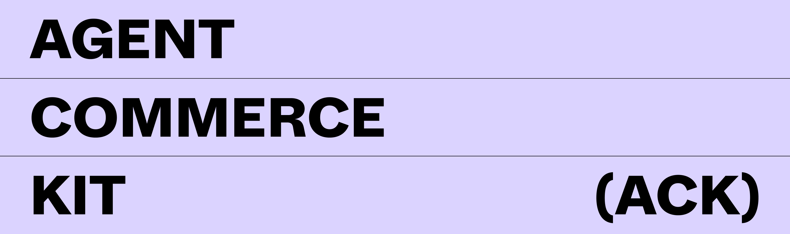

# Agent Commerce Kit (ACK)



<p align="center">
  <a href="https://www.agentcommercekit.com">Documentation</a> |
  <a href="#getting-started">Demos</a> |
  <a href="https://join.slack.com/t/catenalabscommunity/shared_invite/zt-35o31b0r8-RvnEPFaGHqYIkFs6k5QjTA">Slack Community</a>
</p>

**Agent Commerce Kit (ACK)** provides vendor-neutral protocols, patterns, and open source components that enable AI agents to participate in commerce through:

- **Verifiable AI identities** with integrated compliance controls
- **Secure, automated payment processing** across multiple payment rails
- **Auditable receipt verification**
- **Intelligent human oversight** for critical transactions

Built on open **W3C Web Standards**, ACK enables AI Agents to manage their own identities, operate their own accounts and wallets, access paid services through standardized paywalls, compensate humans for data contributions, and optimize costs across complex service chains.

The patterns support extensions for agent discovery, secure communication, micropayments, subscription management, refund management, outcome-based pricing, and cross-currency transactions, all while maintaining appropriate security, privacy, and compliance controls with humans in the loop.

To learn more about the Agent Commerce Kit, check out our [Documentation](https://www.agentcommercekit.com) and [Demos](#getting-started).

## Installation

We recommend you start by running our interactive demos as described in our [Getting Started](#getting-started) guide.

You can also read the [TypeScript SDK Documentation](https://github.com/agentcommercekit/ack/tree/main/packages/agentcommercekit) to start building with the Agent Commerce Kit.

## Getting Started

Agent Commerce Kit consists of two core protocols: [ACK-ID](#ack-id) for identity and [ACK-Pay](#ack-pay) for payments. While they seamlessly operate together, each protocol can be used independently of the other.

One of the best ways to get started with ACK is to see how each component works on its own. We have provided several interactive demos that will walk you through ACK-ID and ACK-Pay.

### Running the Demos

First, be sure you have Node.js and `pnpm` installed (see "[Installing `pnpm`](#installing-pnpm)").

From the root of the repository, run the following command to install the necessary packages and set up local environment variables:

```sh
pnpm run setup
```

Now you're ready to run the demos.

### ACK-ID

First we'll walk through a demo of the **ACK-ID** protocol. In this demo, we'll see two agents communicating together, discovering each other's service endpoints, and exchanging verifiable Identity information -- all while using W3C standard DIDs and VCs.

To use this demo, run the following command:

```sh
pnpm demo:identity
```

You can see the code for this demo in [`./demos/identity`](./demos/identity).

As you can see from the demo, DIDs and Verifiable Credentials can be extremely powerful tools for identity verification and secure communication.

By providing a standardized way to prove ownership chains, agents can securely verify that their counterparty is who they claim to be, such as an e-commerce store. By also exposing service endpoints, agents can broadcast how and where they want to be contacted, as well as other key endpoints they may offer, such as secure KYC exchange APIs.

#### Going Forward

The ACK-ID primitives provide the building blocks for a robust future for agentic Identity. We imagine protocol extensions to support Agent Discovery via registries, reputation scoring, secure end-to-end encrypted communication between agents, controlled authorization, and much more.

To start building with ACK-ID:

- Check out the ACK-ID [TypeScript SDK](./packages/ack-id/)
- Read the ACK-ID [Documentation](https://www.agentcommercekit.com/ack-id)

### ACK-Pay

To show how **ACK-Pay** works, we'll walk through an interactive demo that includes a Server with paywalled content, and a Client who wants to access that content. The Server will use ACK-Pay to provide a standardized `Payment Required` message and offer several accepted payment methods. The Client will make the payment using one of the available methods, and use a Receipt Service to obtain a Verifiable Receipt of the payment. The Client will then use this Receipt to gain access to the secured content on the Server.

To use this demo, run the following command:

```sh
pnpm demo:payments
```

You can see the code for this demo in [`./demos/payments`](./demos/payments).

This demo shows the simplicity and scalability of the ACK-Pay protocol. The protocol does not prescribe any specific payment method, which allows it to work seamlessly with existing payment rails such as Credit Cards and bank transfers, as well as stablecoin payments, and any other to-be-invented payment network.

#### Receipts

One of the most powerful components of the ACK-Pay protocol is the "Payment Receipt". A Receipt is a Verifiable Credential that _proves_ that its holder has satisfied the payment requirements from a given service. A Receipt can represent a one-time use payment, a subscription, metered access, and much more. The Receipts are powerful, secure, and allow for compliant payment flows while also helping maintain privacy.

#### Payment Service

A key component of the ACK-Pay protocol is the concept of a **Payment Service**. While the protocol supports the use of any payment method, developers should not have to manage several integrations while also ensuring **compliant** and **safe** transactions across the globe. Instead, many developers will choose to use a Payment Service, which acts as an intermediary between the server, the client, and the Receipt Service. Payment Services can take several forms, but many will offer multiple payment methods across currencies and geographies, automatic FX and account sweeping, reporting, KYC and compliance services, and much more.

To start building with ACK-Pay:

- Check out the ACK-Pay [TypeScript SDK](./packages/ack-pay/)
- Read the ACK-Pay [Documentation](https://www.agentcommercekit.com/ack-pay)

### End-to-End Demo

To show how **ACK-ID** and **ACK-Pay** can work together to provide safe, compliant, peer-to-peer payments, we have built a simple End-to-End demo. This demo shows how two Agents, both with identities, can communicate, identify each other, and negotiate payments in a simple flow.

To use this demo, run the following command:

```sh
pnpm demo:e2e
```

You can see the code for this demo in [`./demos/e2e`](./demos/e2e).

## Example Services

This repository contains several standalone services as example implementations of the ACK-ID and ACK-Pay protocols, using the `agentcommercekit` TypeScript SDK. These examples are located in the [`./examples`](./examples) directory.

- [Credential Issuer](./examples/issuer): A sample Verifiable Credential issuer which issues and revokes both `ControllerCredential`s and `PaymentReceiptCredential`s for ownership and payment proof, respectively.
- [Credential Verifier](./examples/verifier): A sample Verifiable Credential verifier which checks the validity of Credentials.

You can run each example individually, or start them all together by running the following command:

```sh
pnpm dev:examples
```

## Local Development

### Installing pnpm

The easiest way to install `pnpm` is by using [`corepack`](https://www.npmjs.com/package/corepack)

Node.js 22.x ships with `corepack` by default, which allows you to use pnpm without having to directly install it.

```sh
corepack enable
```

Now the next time you run a `pnpm` command, it will install the necessary version.

### Project Structure

This project is designed as a monorepo containing:

- [Documentation](./docs) - Explanations, specifications, and guides. The official hosted version is located on the [ACK website](https://www.agentcommercekit.com)
- [Demos](#demos) - Walkthrough demos of ACK functionality
- [Example Services](#examples) - Sample implementations of various services using the ACK packages
- [Core Packages](./packages) - Core package code published to NPM, and used by the examples and demos.

### Documentation

The ACK protocol documentation is hosted at [agentcommercekit.com](https://www.agentcommercekit.com), and the source files are located in the [`./docs`](./docs/) directory.

To run the documentation locally:

```sh
pnpm dev:docs
```

## More information

### Decentralized IDs (DIDs)

Decentralized IDs (DIDs) are a standard way to represent and verify digital identities without central authorities. In practical applications, DIDs serve as a lookup mechanism for public keys (enabling secure authentication, encryption, and simple key rotation), service endpoints (allowing the discovery of up-to-date API locations and interaction methods), and Verifiable Credential relationships (establishing ownership chains and delegation rights).

### Verifiable Credentials (VCs)

Verifiable Credentials (VCs) go hand-in-hand with Decentralized IDs. VCs are cryptographically-secure certificates that prove specific information about their holder without relying on access to a centralized authority. They can be used to prove authorization, ownership, or any other relationship or right. In addition, they can optionally be revoked in a privacy-preserving manner. By pairing VCs with DIDs, we are able to securely encrypt and verify data while allowing key rotation and ownership-chain verification.

## Contributing

ACK is open source and freely available to use, modify, and improve. We welcome contributions from the community. See [`CONTRIBUTING.md`](./CONTRIBUTING.md) for more information.

## Security

See [`SECURITY.md`](./SECURITY.md) for instructions on responsibly disclosing any security vulnerabilities.

## License (MIT)

Copyright (c) 2025 [Catena Labs, Inc](https://catenalabs.com). See [`LICENSE`](./LICENSE).
