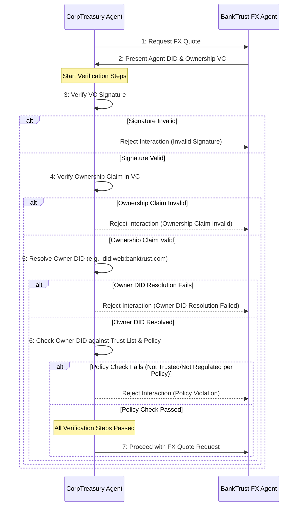

This use case illustrates how ACK-ID enables one agent to securely verify the identity and legitimate ownership of another agent, specifically ensuring it is operated by a recognized, regulated financial institution, before engaging in potentially sensitive interactions.

This example focuses solely on the identity verification aspect, independent of any subsequent payment flows.

## Scenario: Verifying a Financial Agent

A corporate treasury management agent ("CorpTreasury Agent"), operated by Acme Corp, needs to obtain real-time foreign exchange (FX) quotes. Acme Corp's policy mandates that its treasury agent interact only with FX services provided by known, regulated financial institutions to ensure compliance and reduce counterparty risk. The CorpTreasury Agent discovers (or is pre-configured to communicate with) an FX service agent claiming to be operated by "BankTrust," a known regulated bank.

## Identity Setup

- **BankTrust (Owner):**
  - Establishes its Owner DID, linked to its verified legal identity and domain (e.g., `did:web:banktrust.com`).
- **BankTrust FX Agent (Server Agent):**
  - BankTrust creates an Agent DID for its FX service (e.g., `did:web:fx.banktrust.com`).
  - BankTrust, as the Owner, issues an "Ownership & Authorization" VC asserting that `did:web:fx.banktrust.com` is operated by `did:web:banktrust.com` and is authorized to provide FX quoting services.
- **CorpTreasury Agent (Client Agent):**
  - Operates under its own Agent DID, linked back to Acme Corp's verified Owner DID.
  - Maintains a configurable "Trust List" of DIDs corresponding to approved regulated financial institution Owners. `did:web:banktrust.com` is on this list.
  - Is configured with Acme Corp's policy regarding verification requirements (e.g., trusting the `did:web` domain and Trust List status for known entities).

## Interaction & Verification Flow

1. **Request:** CorpTreasury Agent sends a request for an FX quote to the agent endpoint associated with `did:web:fx.banktrust.com`.
2. **Identity and VC Exchange:** As part of establishing a secure interaction, the BankTrust FX Agent presents its Agent DID (`did:web:fx.banktrust.com`) and relevant VCs (including the Ownership & Authorization VC).
3. **CorpTreasury Agent Verification Steps:**
   - **VC Signature Validation:** Verifies the cryptographic signatures on the presented VCs. If any signature is invalid, the interaction is **rejected**.
   - **Ownership Verification:** Checks the "Ownership & Authorization" VC. It confirms the VC was issued by the claimed Owner DID (`did:web:banktrust.com`) and asserts control over the Agent DID (`did:web:fx.banktrust.com`).
   - **Owner Identity Resolution:** Resolves the Owner DID (`did:web:banktrust.com`). This confirms it's associated with the expected `banktrust.com` domain via the `did:web` method (relying on HTTPS security). If the DID cannot be resolved or links to an unexpected domain, the interaction is **rejected**. Note that other non-web DID methods would require different mechanics for resolving identity.
   - **Policy Check:** Based on Acme Corp's policy, since the Owner DID resolved correctly to the trusted domain and is on the Trust List, no further "Regulated Status" VC check is required for this interaction.
4. **Interaction Proceeds:** If all required verification steps pass successfully according to policy, the CorpTreasury Agent trusts that it is interacting with the legitimate FX agent operated by the regulated BankTrust. It proceeds with the FX quote request.

## Failure Scenario Example

Imagine a rogue agent attempting to impersonate BankTrust's FX service. It might present an Agent DID such as `did:web:fx.banktrust.com.rogue.net`. When the CorpTreasury Agent resolves this DID and verifies the presented VCs, it would find:

- The VCs are likely not signed by the legitimate `did:web:banktrust.com` Owner DID (signature verification fails).
- Or, if the rogue entity created its own valid VCs, the Owner DID resolved (`did:web:banktrust.com.rogue.net`) would not be on CorpTreasury's Trust List.

In either case, the verification fails, and the CorpTreasury Agent **rejects** the interaction, preventing engagement with the untrusted agent.

## Reputation and Performance Scenarios

While this example focuses on verifying ownership and regulatory status, future enhancements to the ecosystem could involve additional VC-based checks.

For example, before interacting, the CorpTreasury Agent might also request VCs attesting to the BankTrust FX Agent's **reputation** or **performance metrics** (e.g., average quote accuracy, transaction success rate, uptime), issued by trusted monitoring services.

This would allow the CorpTreasury Agent not only to verify legitimacy but also to assess quality of service and potentially select the best agent among several verified options. ACK-ID provides the foundational layer for such future developments.
