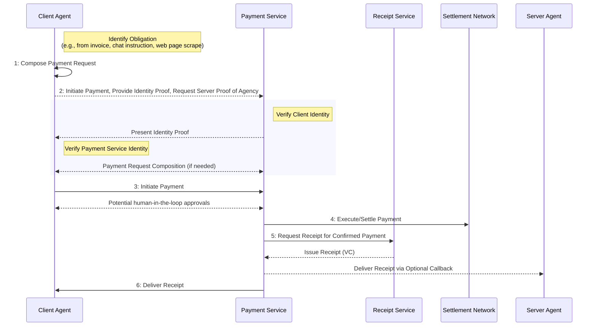

```mermaid

%%{ init: { 'theme': 'mc', 'sequenceMessageAlign': 'center' } }%%
sequenceDiagram;
    participant CA as Client Agent;
    participant PS as Payment Service;
    participant RS as Receipt Service;
    participant SN as Settlement Network;
    participant SA as Server Agent;

    Note right of CA: Identify Obligation <br/> (e.g., from invoice, chat instruction, web page scrape);
    CA<<->>CA: 1: Compose Payment Request;

    CA-->>PS: 2: Initiate Payment, Provide Identity Proof, Request Server Proof of Agency;

    rect rgba(0, 0, 255, .03)
        Note right of PS: Verify Client Identity;
        PS-->>CA: Present Identity Proof;
        Note right of CA: Verify Payment Service Identity;
        CA<<-->>PS: Payment Request Composition (if needed);
    end

    CA->>PS: 3: Initiate Payment;

    PS<<-->>CA: Potential human-in-the-loop approvals;
    PS->>SN: 4: Execute/Settle Payment;
    PS->>RS: 5: Request Receipt for Confirmed Payment;
    RS-->>PS: Issue Receipt (VC);
    PS-->>SA: Deliver Receipt via Optional Callback;
    PS->>CA: 6: Deliver Receipt;
```

_To enlarge this mermaid markdown diagram, zoom in on your browser (CMD +)_
