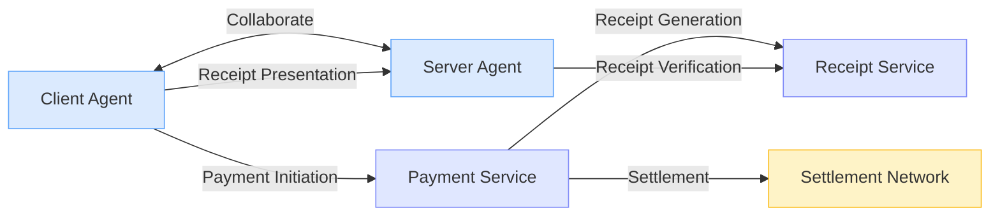

```mermaid
%%{ init: { 'theme': 'mc'} }%%
graph LR;
    CA[Client Agent] <-- Collaborate --> SA[Server Agent];
    CA -- Payment Initiation --> PS[Payment Service];
    PS -- Settlement --> SN[Settlement Network];
    PS -- Receipt Generation --> RS[Receipt Service];
    CA -- Receipt Presentation --> SA;
    SA -- Receipt Verification --> RS[Receipt Service];

    style CA fill:#DBEAFE,stroke:#60A5FA,stroke-width:1px;
    style SA fill:#DBEAFE,stroke:#60A5FA,stroke-width:1px;
    style PS fill:#E0E7FF,stroke:#818CF8,stroke-width:1px;
    style RS fill:#E0E7FF,stroke:#818CF8,stroke-width:1px;
    style SN fill:#FEF3C7,stroke:#FBBF24,stroke-width:1px;

```
