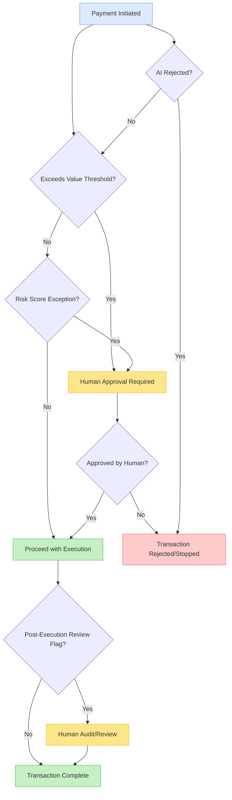

```mermaid
%%{ init: { 'theme': 'mc'} }%%
graph TD;
    A[Payment Initiated];
    B{Exceeds Value Threshold?};
    C{Risk Score Exception?};
    F[Human Approval Required];
    G{Approved by Human?};
    H[Proceed with Execution];
    I[Transaction Rejected/Stopped];

    A --> B;
    B -- Yes --> F;
    B -- No --> C;
    C -- Yes --> F;
    C -- No --> H;
    F --> G;
    G -- Yes --> H;
    G -- No --> I;
    H --> L{Post-Execution Review Flag?};
    L -- Yes --> M[Human Audit/Review];
    L -- No --> N[Transaction Complete];
    M --> N;
    %% Exception Handling Path
    A --> X{AI Rejected?};
    X -- Yes --> I;
    X -- No --> B;


    style A fill:#DBEAFE,stroke:#60A5FA,stroke-width:1px;
    style F fill:#FDE68A,stroke:#FBBF24,stroke-width:1px;
    style H fill:#C4F0C4,stroke:#5CB85C,stroke-width:1px;
    style I fill:#FECACA,stroke:#F87171,stroke-width:1px;
    style M fill:#FDE68A,stroke:#FBBF24,stroke-width:1px;
    style N fill:#C4F0C4,stroke:#5CB85C,stroke-width:1px;
```
