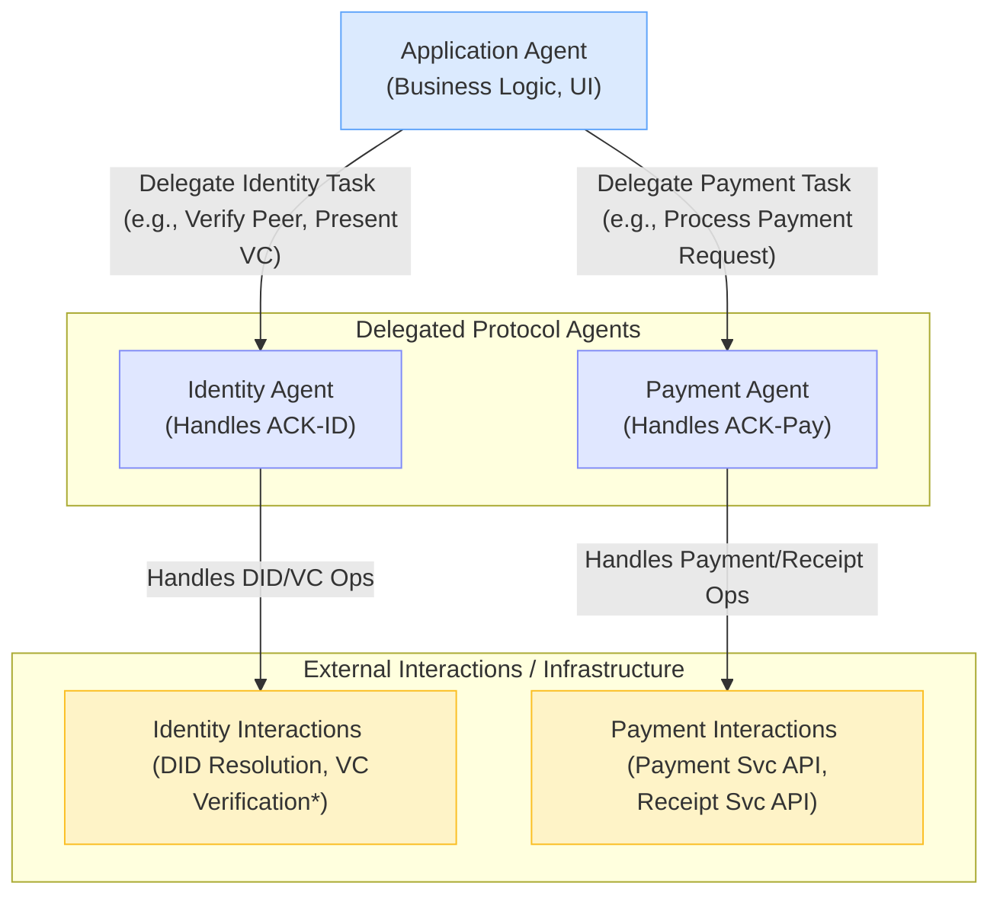

```mermaid
%%{ init: { 'theme': 'mc' } }%%
graph TD;
    AppAgent["Application Agent \n (Business Logic, UI)"];

    subgraph "Delegated Protocol Agents"
        IDAgent["Identity Agent \n (Handles ACK-ID)"];
        PayAgent["Payment Agent \n (Handles ACK-Pay)"];
    end

    subgraph "External Interactions / Infrastructure"
        ExtID["Identity Interactions \n (DID Resolution, VC Verification*)"];
        ExtPay["Payment Interactions \n (Payment Svc API, Receipt Svc API)"];
    end

    AppAgent -- "Delegate Identity Task \n (e.g., Verify Peer, Present VC)" --> IDAgent;
    AppAgent -- "Delegate Payment Task \n (e.g., Process Payment Request)" --> PayAgent;

    IDAgent -- "Handles DID/VC Ops" --> ExtID;
    PayAgent -- "Handles Payment/Receipt Ops" --> ExtPay;

    %% Styling
    style AppAgent fill:#DBEAFE,stroke:#60A5FA,stroke-width:1px;
    style IDAgent fill:#E0E7FF,stroke:#818CF8,stroke-width:1px;
    style PayAgent fill:#E0E7FF,stroke:#818CF8,stroke-width:1px;
    style ExtID fill:#FEF3C7,stroke:#FBBF24,stroke-width:1px;
    style ExtPay fill:#FEF3C7,stroke:#FBBF24,stroke-width:1px;


```
