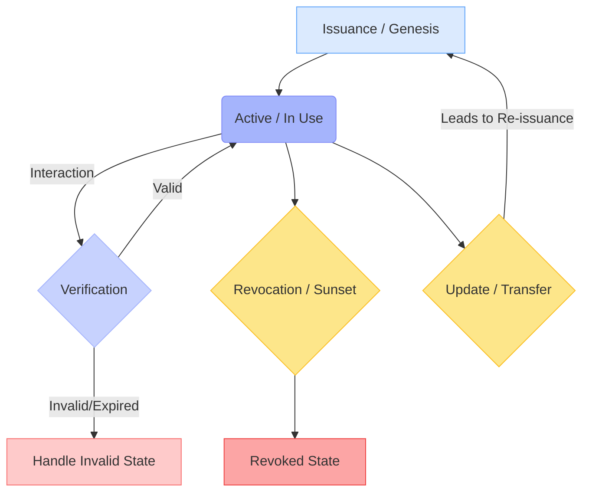

```mermaid

%%{ init: { 'theme': 'mc', 'sequenceMessageAlign': 'center' } }%%
graph TD;
    A[Issuance / Genesis] --> B(Active / In Use);
    B -- Interaction --> C{Verification};
    C -- Valid --> B;
    C -- Invalid/Expired --> D[Handle Invalid State];

    B --> E{Revocation / Sunset};
    E --> F[Revoked State];

    B --> G{Update / Transfer};
    G -- Leads to Re-issuance --> A;

    %% Styling (Optional - remove if clashing with theme)
    style A fill:#DBEAFE,stroke:#60A5FA,stroke-width:1px;
    style B fill:#A5B4FC,stroke:#818CF8,stroke-width:1px;
    style C fill:#C7D2FE,stroke:#A5B4FC,stroke-width:1px;
    style D fill:#FECACA,stroke:#F87171,stroke-width:1px;
    style E fill:#FDE68A,stroke:#FBBF24,stroke-width:1px;
    style F fill:#FCA5A5,stroke:#EF4444,stroke-width:1px;
    style G fill:#FDE68A,stroke:#FBBF24,stroke-width:1px;

```
