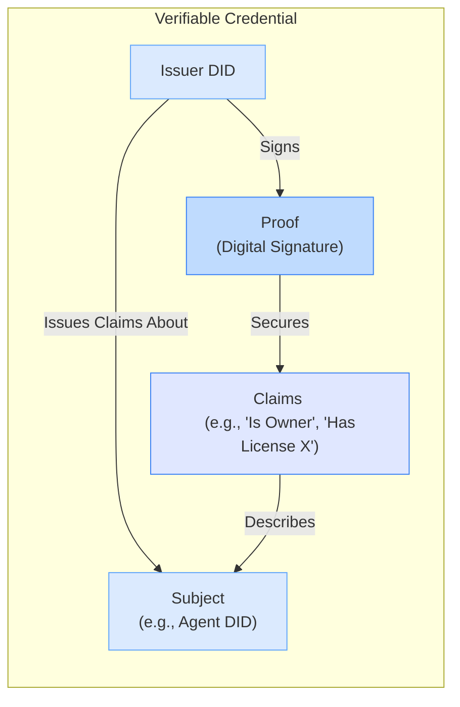

```mermaid
%%{ init: { 'theme': 'mc' } }%%
graph LR;
    subgraph "Verifiable Credential"
        Issuer["Issuer DID"] -- Signs --> Proof["Proof \n (Digital Signature)"];
        Issuer -- Issues Claims About --> Subject["Subject \n (e.g., Agent DID)"];
        Claims["Claims \n (e.g., 'Is Owner', 'Has License X')"] -- Describes --> Subject;
        Proof -- Secures --> Claims;
    end

    style Issuer fill:#DBEAFE,stroke:#60A5FA,stroke-width:1px;
    style Subject fill:#DBEAFE,stroke:#60A5FA,stroke-width:1px;
    style Claims fill:#E0E7FF,stroke:#3B82F6,stroke-width:1px;
    style Proof fill:#BFDBFE,stroke:#3B82F6,stroke-width:1px;
```
