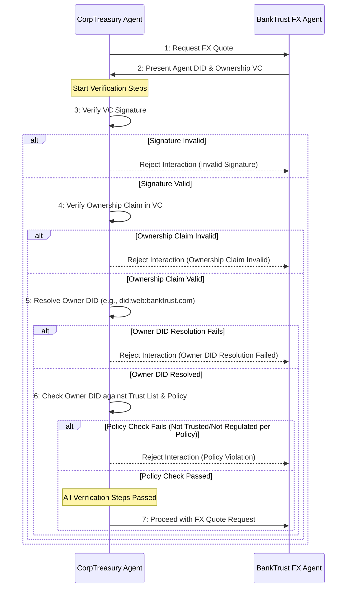

```mermaid
%%{ init: { 'theme': 'mc', 'sequenceMessageAlign': 'center' } }%%
sequenceDiagram;
    participant Client as CorpTreasury Agent;
    participant Server as BankTrust FX Agent;

    Client->>Server: 1: Request FX Quote;
    Server->>Client: 2: Present Agent DID & Ownership VC;

    Note over Client: Start Verification Steps;
    Client->>Client: 3: Verify VC Signature;
    alt Signature Invalid
        Client-->>Server: Reject Interaction (Invalid Signature);
    else Signature Valid
        Client->>Client: 4: Verify Ownership Claim in VC;
        alt Ownership Claim Invalid
            Client-->>Server: Reject Interaction (Ownership Claim Invalid);
        else Ownership Claim Valid
            Client->>Client: 5: Resolve Owner DID (e.g., did:web:banktrust.com);
            alt Owner DID Resolution Fails
                Client-->>Server: Reject Interaction (Owner DID Resolution Failed);
            else Owner DID Resolved
                Client->>Client: 6: Check Owner DID against Trust List & Policy;
                alt Policy Check Fails (Not Trusted/Not Regulated per Policy)
                    Client-->>Server: Reject Interaction (Policy Violation);
                else Policy Check Passed
                    Note over Client: All Verification Steps Passed;
                    Client->>Server: 7: Proceed with FX Quote Request;
                end
            end
        end
    end
```
